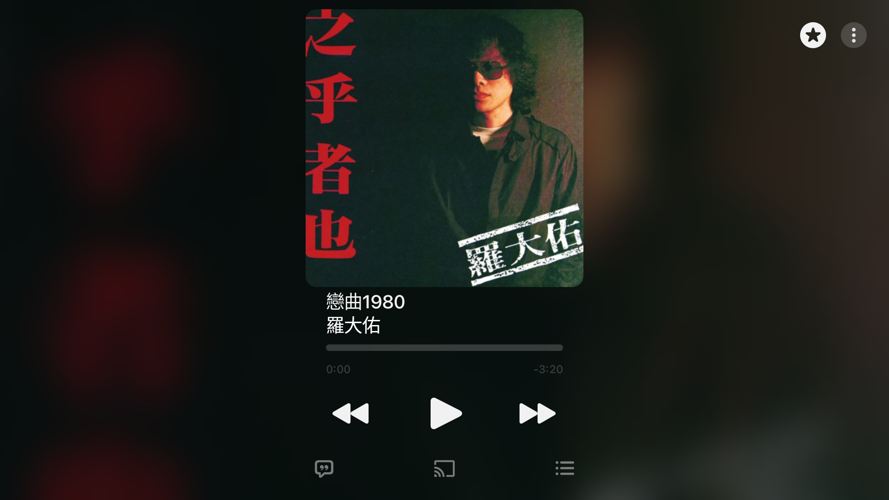
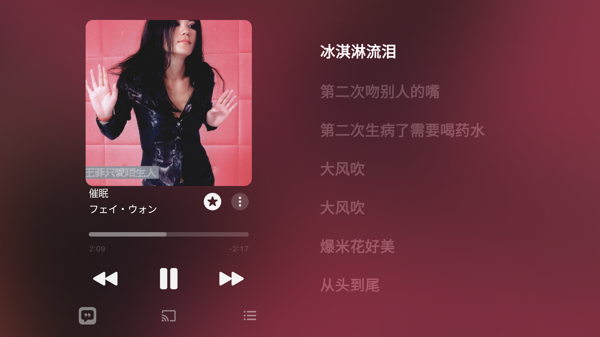
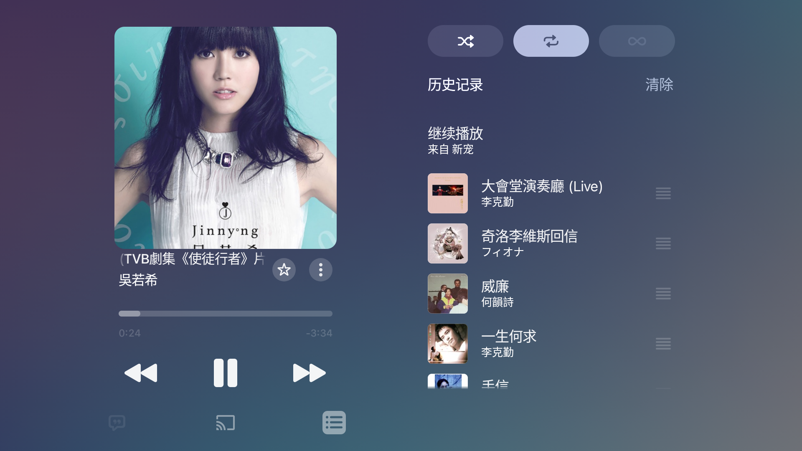
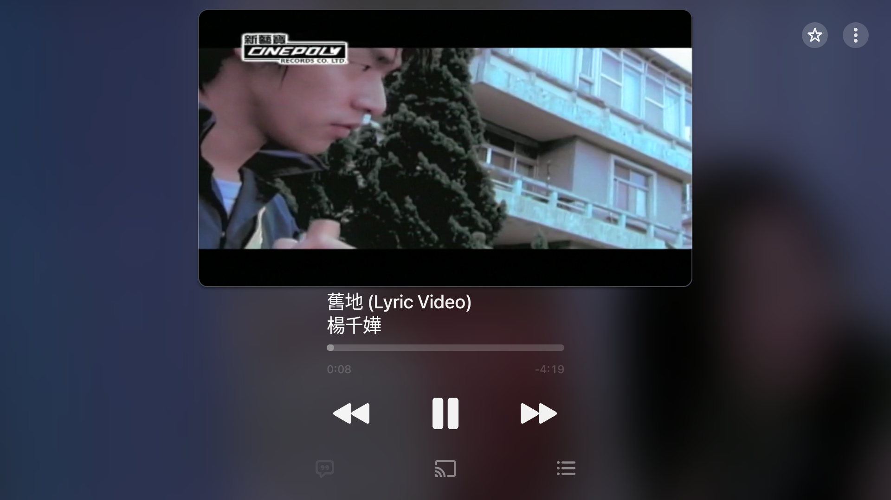
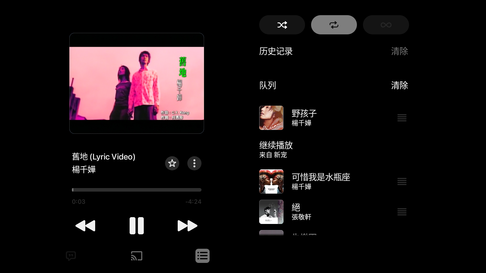

<p align="center">
  <a href="README.md"><strong>简体中文</strong></a> ·
  <a href="README_EN.md"><strong>English</strong></a>
</p>

# Apple Music Android 横屏补丁器

面向 Android TV 和可安装第三方 APK 的 Android 车机，在用户电脑本地把 **Apple Music 6.5.0 (1580)** 重建为更适合横屏的版本。

它解决有线网络被误判为离线的问题，并加入横屏 HOME、歌词、待播、视频歌曲布局与触摸下滑收起；车机配置另带沉浸式系统栏处理。

> 本仓库只发布原创补丁源码和构建脚本，不包含 Apple Music APK、Apple 资源、反编译 DEX 或通用签名密钥。使用者必须自行取得正版安装包，并遵守所在地法律和 Apple 的服务条款。本项目与 Apple Inc. 无关。

## 操作方式

横屏播放器目前主要按触控和鼠标指针操作设计。电视端建议连接 USB / 蓝牙鼠标、空中鼠标，或使用能够模拟屏幕指针的遥控器。

普通方向键遥控器的焦点移动、按钮选择和列表操作尚未完整适配，仅使用方向键与确认键时，部分控件可能无法到达或操作。触控平板和车机可以直接使用触摸操作。

## 快速开始（无需命令行）

1. 从本项目 Release 下载 Windows 补丁器 ZIP，并完整解压。
2. 从 [APKMirror 的 Apple Music 6.5.0 (1580) 页面](https://www.apkmirror.com/apk/apple/apple-music/apple-music-6-5-0-release/apple-music-6-5-0-android-apk-download/) 自行下载 APKM；本项目不镜像、不代下载 Apple 安装包。
3. 双击 `Start-Patcher.cmd`，选择刚下载的 APKM，再按中文提示选择电视或车机。
4. 等待工具自动下载、校验、合并、打补丁和本地签名。完成后会自动打开成品所在文件夹。

完整操作步骤见 [Windows 快速操作指南](docs/QUICK_START.md)。
补丁结构与扩展方法见 [解包、改写、重打包原理与开发流程](docs/HOW_IT_WORKS.md)。

## 构建配置

| 构建参数 | 推荐设备 | 输出形式 |
|---|---|---|
| `tv-armv7` | 32 位 Android TV | ARMv7、全密度单 APK |
| `tv-arm64` | 64 位 Android TV / Google TV | ARM64、全密度单 APK |
| `car-armv7` | 较老的 32 位 Android 车机 | ARMv7、全密度、沉浸式单 APK |
| `car-arm64` | ARM64 Android 车机、比亚迪 DiLink 类设备 | ARM64、全密度、沉浸式单 APK |
| `tv-armv7-xhdpi` | 已验证的索尼电视精简配置 | ARMv7、xhdpi 单 APK |

最低 Android 11。请选择与设备 CPU 架构和用途相符的配置，详情见 [兼容性与构建配置](COMPATIBILITY.md)。

## Windows 命令行构建（可选）

准备：Windows 10/11、PowerShell 7（Windows PowerShell 5.1 也可）、约 5 GB 空闲空间，以及指定版本的 Apple Music APKM。

```powershell
Set-ExecutionPolicy -Scope Process Bypass
.\scripts\setup-toolchain.ps1
.\scripts\build.ps1 -InputApkm "D:\Downloads\AppleMusic-6.5.0.apkm" -Profile tv-arm64
```

首次准备会从官方发布地址下载锁定版本的 Temurin JDK、Android SDK 组件、APKEditor 和 Apktool，并自动校验文件。首次构建会在 `.local\signing` 生成你自己的签名密钥；请备份该目录。

输出位于 `dist`。由于签名不同，通常不能覆盖 Apple 官方版本；安装前请确认账号和离线下载可恢复，再卸载原版。

## 安装

生成的是单 APK。电视允许安装未知来源应用时，可以把 APK 复制到 U 盘、电视内部存储或局域网共享目录，再用电视文件管理器打开安装，**不需要 ADB**。

网络 ADB 是可选安装方式，适用于电视没有可用文件管理器、U 盘安装入口受限，或需要在电脑上查看安装错误的情况。构建向导可自动完成连接和安装；命令行示例：

```powershell
$adb = Get-ChildItem ".\.local\toolchain\platform-tools" -Filter adb.exe -Recurse | Select-Object -First 1
& $adb.FullName connect "电视IP:5555"
& $adb.FullName install "dist\AppleMusic-6.5.0-1580-tv-arm64-patched.apk"
```

如果电视提示签名冲突，需先确认账号与离线下载可以恢复，再手动卸载 Apple 官方版；补丁器不会自动卸载或清除数据。

车机可使用厂商允许的 U 盘、文件管理器或调试安装入口。本项目不会提供或绕过工程密码、安全签名、驾驶限制。驾驶时不要操作播放器。

## SHA-256 是什么

SHA-256 是下载文件的校验指纹，不是密码、激活码或账号资料。使用者不需要把它提供给项目作者，也不需要在构建向导里手动输入；向导会自动核对基础包。Release 页面提供的 SHA-256 仅用于自愿检查补丁器 ZIP 是否下载完整。

## 功能范围

- 有线网络识别：首页、歌词和在线搜索不再仅依赖 Wi-Fi / 蜂窝网络判断。
- 横屏 HOME：封面 / 视频画面、歌曲信息、进度和控制区重排。
- 歌词 / 待播：复用原播放器的数据和按钮状态，横屏左右分栏。
- 视频歌曲：播放器形态间尽量复用原视频输出，不以静态封面代替视频。
- 触摸 / 鼠标：支持页面按钮与整页下滑收起；车机配置隐藏系统栏。
- 本地签名：密钥和安装包仅保留在使用者电脑。

## 效果图

效果图均为 16:9、相同展示宽度，一行一图；点击图片可查看原图。

### 普通歌曲 HOME

<p align="center"></p>

### 普通歌曲歌词

<p align="center"></p>

### 普通歌曲待播

<p align="center"></p>

### 视频歌曲 HOME

<p align="center"></p>

### 视频歌曲待播

<p align="center"></p>

## 已知问题

该补丁是在闭源手机应用上做运行时重排，不是完整重写。快速连续切页、视频首帧、部分无歌词 / 队列边界状态，仍可能受原版回调、网络和厂商解码器影响。完整列表见 [已知问题](KNOWN_ISSUES.md)。

## 自愿支持

项目保持免费；赞赏不解锁功能，也不影响问题反馈和更新。愿意支持维护的话，可查看 [自愿支持方式](SUPPORT.md)。

## 开发与发布安全

发布前运行：

```powershell
.\scripts\audit-release.ps1
```

补丁对输入文件和目标代码锚点均采用失败即停止的校验。升级 Apple Music 版本时必须重新审计，不能直接忽略校验。安全细节见 [SECURITY.md](SECURITY.md)，第三方工具见 [THIRD_PARTY_NOTICES.md](THIRD_PARTY_NOTICES.md)。

## 开发说明

本项目由维护者提出需求、确定交互方案并完成电视与车机真机测试，代码和文档主要在 OpenAI Codex 协助下编写。项目维护者负责最终审核、发布和后续维护。

## 许可

本仓库原创代码使用 Apache-2.0；Apple Music 及第三方工具不在此许可范围内。
